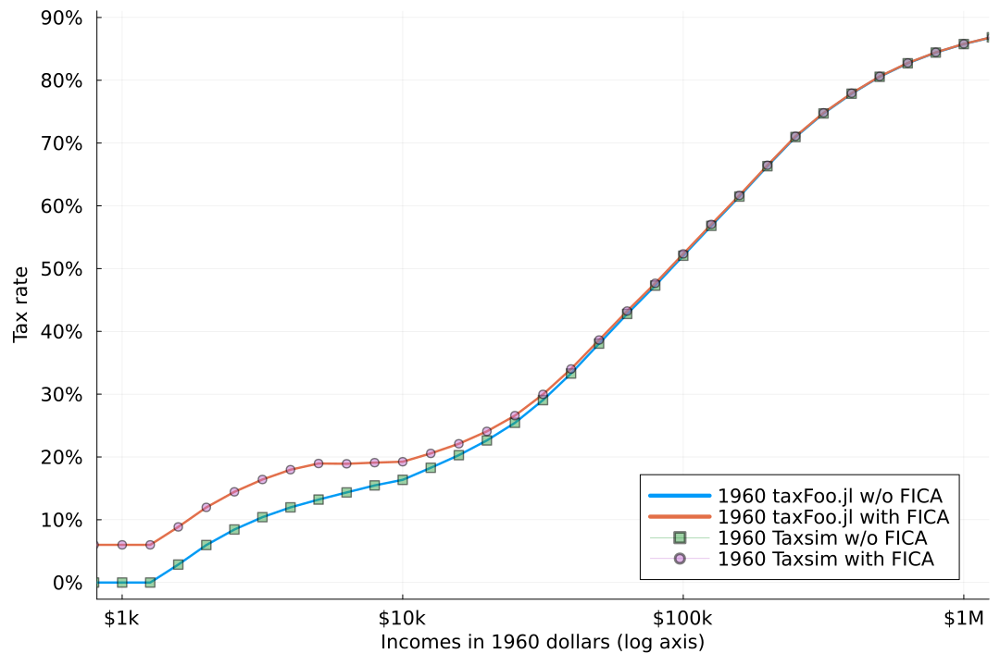
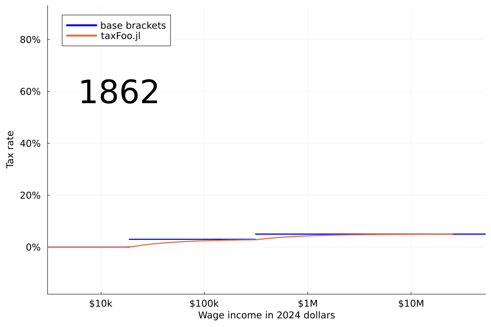

# taxFoo.jl

Using data from
[taxfoundation.org](https://taxfoundation.org/data/all/federal/historical-income-tax-rates-brackets/)
and other sources, this package provides a few tools to inspect
historical US income tax brackets and standard deductions.  The
initial goal was the following rough visualizations of
tax rates back to 1862.  The code and data were put together into a
Julia package to show how the plots were produced. There may be
errors; use with caution!

The first graph shows the 2023 income tax brackets, the effective tax
rate implied by those brackets without any deductions, the effective
tax rate with the standard deduction, and finally the effective rate
from [Taxsim](https://www.nber.org/research/data/taxsim).  All data
are for the filing status "married filing jointly", other filing
statuses are similar. Taxsim includes the [Earned income tax
credit](https://en.wikipedia.org/wiki/Earned_income_tax_credit) (EITC)
which the other curves do not; this is the reason for the difference
between the Taxsim curve and the "tax w deduction from taxFoo.jl"
curve at low incomes. 

One conclusion from the figure above might be to simply use Taxsim to
look at US tax rates; unfortunately Taxsim does not provide taxes for
years earlier than 1960. The tax structure is has become more complex
over time, if we can get taxFoo.jl to match Taxsim in 1960, this will
give some confidence that it would match in prior years. The figure
below shows that indeed we do match Taxsim in 1960; it also shows that
we match Taxsim if we include FICA (Social Security and Medicare)
taxes.

The next figure shows an animation of US income tax from 1862 to 2024,
with all incomes converted into 2024 dollars using [CPI
data](https://www.minneapolisfed.org/about-us/monetary-policy/inflation-calculator/consumer-price-index-1800-)
from the Minneapolis Fed. In years where there is an income tax, the
base tax brackets are shown. Before 1960 the effective rate (with
deductions) from taxFoo.jl is shown, and after 1960, the rate from
Taxsim is shown. Starting in 1937, we also show the tax rate including
FICA taxes.

Taxsim is a much more powerful and respected tool, and we would love
to have data prior to 1960 from it. Even so, we believe that taxFoo.jl
is a useful tool to inspect the tax rate in these early years of the
income tax.

