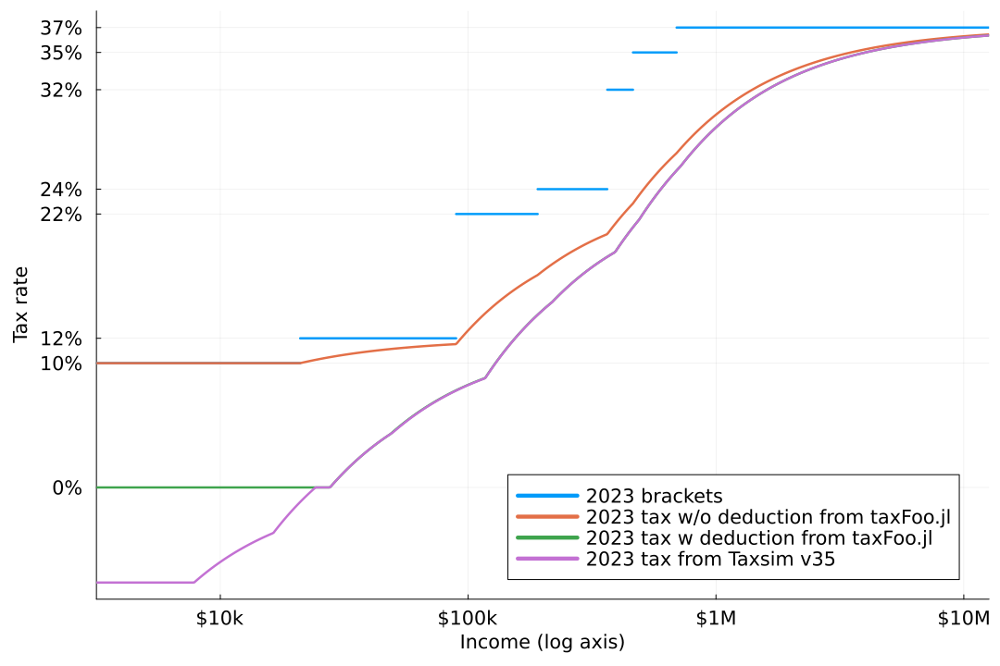
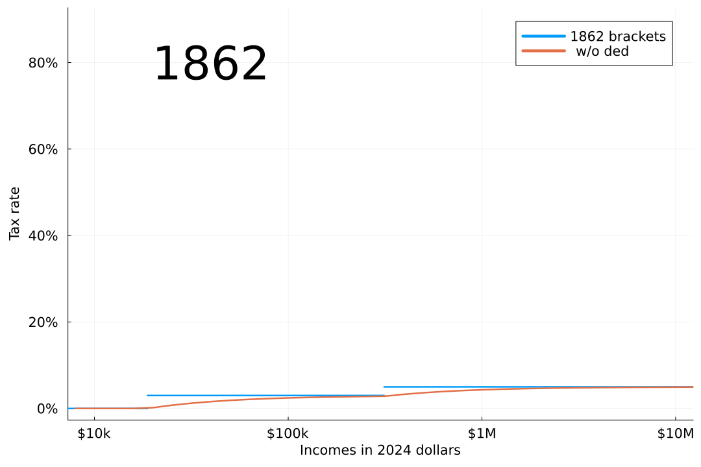

# taxFoo.jl

Using data from
[taxfoundation.org](https://taxfoundation.org/data/all/federal/historical-income-tax-rates-brackets/)
and other sources, this package provides a few tools to inspect
historical US income tax brackets and standard deductions.  The
initial goal was the following rough visualizations of
tax rates back to 1862.  The code and data were put together into a
Julia package to show how the plots were produced. There may be
errors; use with caution!

The first graph shows the 2023 income tax brackets, the effective tax
rate implied by those brackets without any deductions, the effective
tax rate with the standard deduction, and finally the effective rate
from [Taxsim](https://www.nber.org/research/data/taxsim).  All data
are for the filing status "married filing jointly", other filing
statuses are similar. Taxsim includes the [Earned income tax
credit](https://en.wikipedia.org/wiki/Earned_income_tax_credit) (EITC)
which the other curves do not; this is the reason for the difference
between the Taxsim curve and the "tax w deduction from taxFoo.jl"
curve at low incomes. 

In other years and scenarios, the other taxes and tools that Taxsim
includes make larger differences, for example the [maximum tax on
earned income](https://www.law.cornell.edu/cfr/text/26/1.1348-2) used
in the 70s and 80s, tax exemptions, and FICA taxes are all
implemented by Taxsim but not by taxFoo.jl. Unfortunately Taxsim does
not provide taxes for years earlier than 1960; one goal of this
package is to look as far back as 1862.

The next figure shows an animation of US income tax from 1862 to 2024,
with all incomes converted into 2024 dollars using [CPI
data](https://www.minneapolisfed.org/about-us/monetary-policy/inflation-calculator/consumer-price-index-1800-)
from the Minneapolis Fed. In years where there is an income tax, the
base tax brackets are shown, as well as the effective rate with
deductions (labeled "taxFoo.jl"), and (after 1960) the rate from
Taxsim. 

For 1960-63 (and a few other years) the "taxFoo.jl" and "Taxsim"
curves are the same, giving some confidence to taxFoo estimates prior
to 1960. We will continue to look at the differences between taxFoo.jl
and Taxsim calculations with the goal of a rough understanding of 
US income tax before and after 1960.

