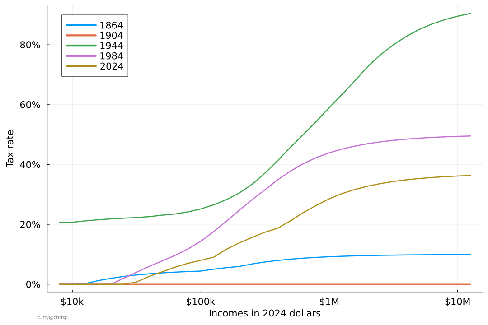

# taxFoo.jl

Using data from
[taxfoundation.org](https://taxfoundation.org/data/all/federal/historical-income-tax-rates-brackets/)
and other sources, this package provides a few tools to inspect
historical US income tax brackets and standard deductions. 
The initial goal of this package was the following rough visualizations. 
The code and data were together into a Julia package to show
how the plots were produced. There may be errors; use with caution!

The first graph shows the 2023 income tax brackets, the effective tax
rate implied by those brackets without any deductions, the effective
tax rate with the standard deduction, and finally the effective rate
from [Taxsim](https://www.nber.org/research/data/taxsim). All data are
for the filing status "married filing jointly", other filing statuses
are similar. Taxsim includes other taxes other than the basic income
tax brackets and deductions (for example FICA taxes), but does not
provide data earlier than 1960. Taxsim is a wonderful tool which
we we will continue comparing with and working to understand, but we
will not refer to it in the rest of this README. 

The next figure shows an animation of US income tax from 1862 to 2024,
with all incomes converted into 2024 dollars using
[CPI](https://www.minneapolisfed.org/about-us/monetary-policy/inflation-calculator/consumer-price-index-1800-)
data from the Minneapolis Fed.  There's so much history in this
animation that it's almost hard to talk about.

In the next figure (below) the tax for a few specific years (40-year increments from 1864 to 2024) is shown.
We see the low tax in the 1860s, no income tax of 1904, the high wartime tax of 1944, 
the tax in the middle of the Reagan years (before his final tax cuts), 
and finally the rates for tax year 2024.

All the figures above assume a "Married filing Jointly" status.
